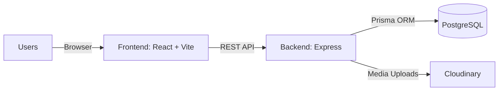

# SocioSphere — Smart Society Management System

A full-stack SaaS-style web application for managing residential housing societies in India (still in development).

##  Tech Stack

**Frontend:** React (Vite), TailwindCSS v3, React Router v6, Axios, React Hook Form, Recharts, Lucide React  
**Backend:** Node.js, Express.js, Prisma ORM, PostgreSQL, JWT, bcryptjs  
**Design:** Glassmorphism dark theme, role-based UI (Admin / Resident)

---

##  Features

| Module | Description |
|--------|-------------|
|  Auth | Register / Login with JWT, role-based access |
|  Resident Management | Admin CRUD for all residents |
|  Community Polls | Create polls, cast votes, auto-expire, AI summary |
|  Parking Management | Visual slot grid, assign/release, bulk creation |
|  Marketplace | Buy/sell second-hand items with image upload & AI categorization |
|  Notifications | Per-user inbox + admin broadcast |
|  AI Insights | Dashboard analytics with activity logs, priority queue, and maintenance forecast |
|  AI Assistant | Resident Q&A assistant and complaint triage guidance |
|  Notice Generator | Admin AI draft + broadcast from AI Insights |
|  Theme Toggle | Light and dark mode support |
|  Profile | Update profile info & change password |

---

##  How It Works

- **Auth + roles:** Users authenticate via JWT. Admins and residents see role-based routes and navigation.
- **Data flow:** Frontend calls REST APIs (Express) that read/write PostgreSQL through Prisma.
- **Admin ops:** Admins manage residents, parking slots, polls, and notifications from the admin dashboard.
- **Resident ops:** Residents use dashboards to vote, view parking assignments, and browse the marketplace.
- **AI tooling:** AI endpoints provide summaries, priority queues, follow-up lists, notice drafts, and a resident Q&A assistant.

---

##  Architecture (Minimal)



---

##  Use Cases

- **Committee/Admin:** Broadcast notices, monitor engagement, prioritize issues, and manage parking capacity.
- **Residents:** Get quick answers, submit clearer complaints, and track society updates in one place.
- **Operations:** Reduce manual follow-ups and improve response time with AI-driven triage.

---

##  Setup & Installation

### Prerequisites
- Node.js 18+
- PostgreSQL 14+ (running locally)
- A Cloudinary account (free tier works)

---


##  Demo Credentials

| Role | Email | Password |
|------|-------|----------|
| Admin | admin@sociosphere.com | admin123 |
| Resident | rahul@example.com | resident123 |

> All 5 seeded residents use the password `resident123`  
> Other resident emails: `priya@example.com`, `amit@example.com`, `sneha@example.com`, `vikram@example.com`

---

##  Project Structure

```
sociosphere/
├── backend/
│   ├── prisma/
│   │   ├── schema.prisma       # Database schema
│   │   └── seed.js             # Demo data seeder
│   ├── src/
│   │   ├── config/             # Prisma & Cloudinary config
│   │   ├── controllers/        # Business logic (auth, residents, polls, etc.)
│   │   ├── middleware/         # Auth, validation, error, upload
│   │   └── routes/             # Express route definitions
│   ├── server.js               # Express app entry point
│   └── .env                    # Environment variables
│
└── frontend/
    ├── src/
    │   ├── components/
    │   │   ├── layout/         # Sidebar, Topbar, AppLayout
    │   │   └── common/         # Shared UI components
    │   ├── context/            # AuthContext (JWT state)
    │   ├── pages/
    │   │   ├── Landing.jsx
    │   │   ├── auth/           # Login, Register
    │   │   ├── admin/          # Dashboard, Residents, AI Insights
    │   │   ├── resident/       # Resident Dashboard
    │   │   ├── polls/
    │   │   ├── parking/
    │   │   ├── marketplace/
    │   │   ├── notifications/
    │   │   └── profile/
    │   ├── services/           # Axios API service layer
    │   └── App.jsx             # React Router configuration
    └── vite.config.js          # Vite + API proxy config
```

---